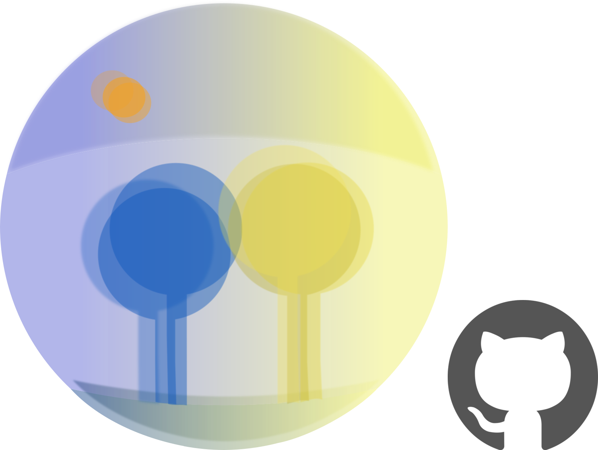

    

# Arda
Arda is a photo-sharing server written in 939 lines of Scala 3 built on the CatsEffect/Fs2/http4s stack. It deliberately avoids FR/ORM's in favour of a "Raw JDBC" style.

### Features
- JWT Auth
- Admin/user roles
- Customizable storage engines
